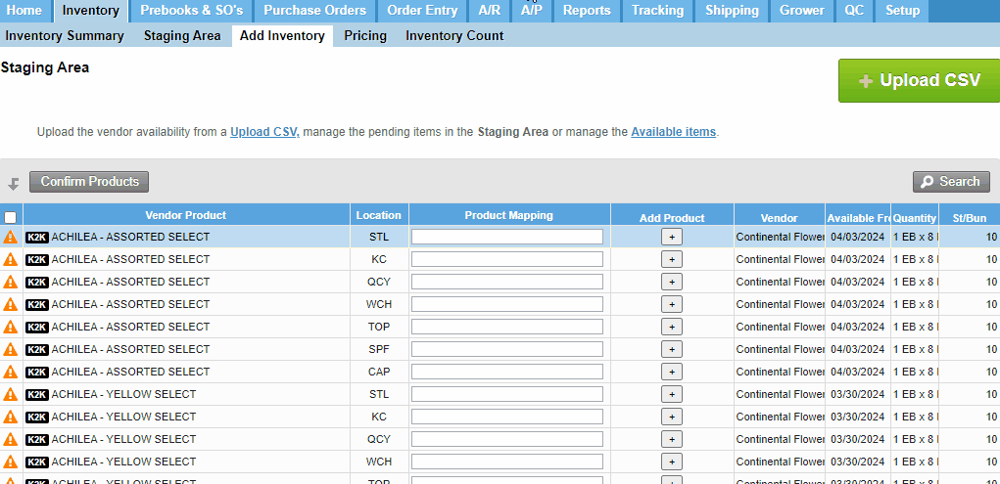

# Komet Mapping Tool

A chrome extension that adds the ability to create products directly from the k2k vendor availability staging area.

## Features

-  Komet API Token Storage
- Autofill that parses the vendor's product category, variety, color with a decent success rate.
- Create products directly from the staging area of Komet Sales.
- Legacy code generation (first 4 letters of category, and first 3 letters of color)

## Installation

Due to the approaching deprecation of the manifest version this extension was created with, it is not listed on the Chrome Web Store, and will have to be installed as an unpacked chrome extension.

1. Download and extract the ZIP file of the extension.
2. Open the Chrome browser and navigate to `chrome://extensions/`.
3. Enable Developer Mode by clicking the toggle switch next to **Developer mode**.
4. Click the **Load unpacked** button and select the extension directory.

## How to Use

1. If you haven't already saved your API Token - Click on the extension icon in the chrome toolbar near the top-right of the window, and enter your API token, then click "Save Token". This should only have to be done after the initial installation.
    
    1a. If the icon is not present, click the puzzle piece icon in the toolbar, then click on the "Komet Sales Product Mapping Tool".
2. Navigate to the chrome extension folder and execute the python script in the "Python Server" folder.
3. Once the python script is running, navigate to the Vendor Availability Staging Area, and wait for the "+" to appear in the column next to the "Product Mapping" column.
4. Once it's determined that a product needs added, click the "+" button.
5. Edit the fields as neccesary, and click enter.
6. Wait approximately 1 second, or for a notification to appear (if enabled), then the product will be available to map.

## Notes

To make room for the "Add Product" column, the "Unit Price" column at the end of the table is excluded.

Due to Komet's CORS policy, the extension is unable to send requests from app.kometsales.com to api.kometsales.com, so a simple python webserver is used as a proxy to route the api requests.

The "Add Product" column can take up to 3 seconds to add to the page. If it doesn't appear, click the chrome extension icon in the toolbar, and click "Add Column".

The autofill feature uses a massive list of categories, colors, grades, and mainly varieties that were populated from several vendors entire product lists. There will be similar entries, and slight differences from your preferred nomenclature. Adjusting the arrays at the beginning of the KometMappingTool.js script may provide better results.

This extension was hastily written to assist with our implementation, and is not fully optimized, but *is* fully functional. 

## License

This extension is released under the MIT License. See the [LICENSE](./LICENSE) file for more details.
